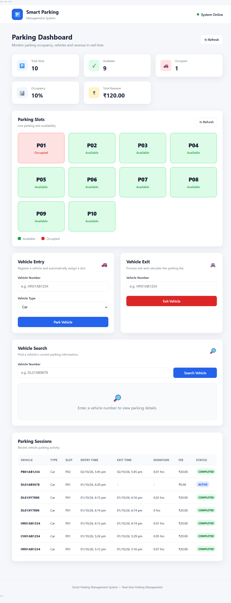
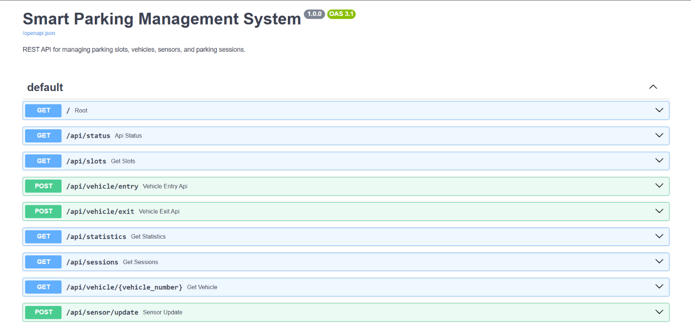

# 🚗 Smart Parking Management System

A full-stack **Smart Parking Management System** designed to manage parking slots, vehicle entry and exit, parking sessions, fee calculation, occupancy statistics, sensor simulation, and REST API communication through an interactive web dashboard.

The project demonstrates practical implementation of **Python, FastAPI, SQLite, SQL, REST APIs, JavaScript, HTML/CSS, data analysis, and dashboard development**.

---

## 📊 Dashboard Preview



The dashboard provides a centralized view of:

* Total parking slots
* Available slots
* Occupied slots
* Occupancy rate
* Parking revenue
* Current parking-slot status
* Vehicle entry and exit operations
* Vehicle search
* Parking session history

---

## 🔌 API Documentation

The backend provides REST APIs through FastAPI and automatically generated Swagger documentation.



Swagger UI is available at:

```text
http://127.0.0.1:8000/docs
```

---

## 🎯 Project Objective

The objective of this project is to develop a practical parking management solution that can:

1. Track parking-slot availability.
2. Register vehicles entering the parking area.
3. Automatically assign available parking slots.
4. Prevent duplicate active parking entries.
5. Record vehicle exit information.
6. Calculate parking duration and parking fees.
7. Maintain parking-session history.
8. Provide occupancy and revenue statistics.
9. Simulate parking sensors.
10. Expose the system through REST APIs.
11. Display parking information through a web dashboard.

---

## ✨ Key Features

### 🅿️ Parking Slot Management

* 10 parking slots initialized automatically.
* Real-time available/occupied status.
* Automatic slot assignment.
* Slot released after vehicle exit.

### 🚘 Vehicle Management

* Vehicle number registration.
* Vehicle type tracking.
* Duplicate active-entry prevention.
* Vehicle search functionality.
* Vehicle parking history.

### 💰 Parking Fee Management

* Automatic parking-duration calculation.
* Fee calculation based on parking duration.
* Revenue tracking.

### 📊 Analytics Dashboard

* Total slots
* Available slots
* Occupied slots
* Occupancy percentage
* Total vehicles
* Total revenue

### 📡 Sensor Simulation

The system includes a simulated parking sensor endpoint that can update the status of individual parking slots.

### 🔌 REST API

FastAPI provides endpoints for:

* Parking status
* Parking slots
* Vehicle entry
* Vehicle exit
* Statistics
* Parking sessions
* Vehicle search
* Sensor updates

---

## 🛠️ Technology Stack

| Technology | Purpose                               |
| ---------- | ------------------------------------- |
| Python     | Backend programming and parking logic |
| FastAPI    | REST API development                  |
| SQLite     | Relational database                   |
| SQL        | Database operations and queries       |
| HTML       | Frontend structure                    |
| CSS        | Dashboard styling                     |
| JavaScript | Frontend logic and API communication  |
| Uvicorn    | FastAPI application server            |
| Git/GitHub | Version control and project hosting   |

---

## 🏗️ System Architecture

```text
                    ┌──────────────────────────┐
                    │       Web Dashboard      │
                    │      HTML / CSS / JS     │
                    └────────────┬─────────────┘
                                 │
                                 │ REST API
                                 ▼
                    ┌──────────────────────────┐
                    │       FastAPI Backend     │
                    │       Python / Uvicorn    │
                    └────────────┬─────────────┘
                                 │
              ┌──────────────────┼──────────────────┐
              │                  │                  │
              ▼                  ▼                  ▼
       Parking Logic       Sensor Simulator     Statistics
              │
              ▼
                    ┌──────────────────────────┐
                    │       SQLite Database     │
                    │                           │
                    │ parking_slots             │
                    │ vehicles                  │
                    │ parking_sessions          │
                    └──────────────────────────┘
```

---

## 🔄 Parking Workflow

```text
Vehicle Arrives
       │
       ▼
Enter Vehicle Number
       │
       ▼
Check Existing Active Session
       │
       ├── Already Parked → Reject Entry
       │
       ▼
Find Available Slot
       │
       ├── No Slot Available → Reject Entry
       │
       ▼
Assign Parking Slot
       │
       ▼
Create Parking Session
       │
       ▼
Vehicle Parked
       │
       ▼
Vehicle Exit Request
       │
       ▼
Calculate Parking Duration
       │
       ▼
Calculate Parking Fee
       │
       ▼
Complete Parking Session
       │
       ▼
Release Parking Slot
```

---

## 🗄️ Database Design

The system uses SQLite for persistent data storage.

### `parking_slots`

| Column      | Description             |
| ----------- | ----------------------- |
| id          | Unique slot ID          |
| slot_number | Parking slot identifier |
| status      | Current slot status     |

### `vehicles`

| Column         | Description                 |
| -------------- | --------------------------- |
| id             | Unique vehicle ID           |
| vehicle_number | Vehicle registration number |
| vehicle_type   | Type of vehicle             |

### `parking_sessions`

| Column     | Description            |
| ---------- | ---------------------- |
| id         | Unique session ID      |
| vehicle_id | Vehicle reference      |
| slot_id    | Parking-slot reference |
| entry_time | Vehicle entry time     |
| exit_time  | Vehicle exit time      |
| duration   | Parking duration       |
| fee        | Calculated parking fee |
| status     | Session status         |

---

## 🔌 REST API Endpoints

| Method | Endpoint                        | Purpose                           |
| ------ | ------------------------------- | --------------------------------- |
| GET    | `/`                             | API welcome/status                |
| GET    | `/api/status`                   | Backend status                    |
| GET    | `/api/slots`                    | Retrieve parking-slot information |
| POST   | `/api/vehicle/entry`            | Register vehicle entry            |
| POST   | `/api/vehicle/exit`             | Register vehicle exit             |
| GET    | `/api/statistics`               | Retrieve parking statistics       |
| GET    | `/api/sessions`                 | Retrieve parking-session history  |
| GET    | `/api/vehicle/{vehicle_number}` | Search vehicle information        |
| POST   | `/api/sensor/update`            | Simulate parking sensor update    |

Interactive API documentation:

```text
http://127.0.0.1:8000/docs
```

---

## 📁 Project Structure

```text
Smart-Parking-Management-System/
│
├── backend/
│   ├── app.py
│   ├── database.py
│   ├── parking.py
│   └── simulator.py
│
├── data/
│   └── parking.db
│
├── frontend/
│   ├── index.html
│   ├── script.js
│   └── style.css
│
├── screenshots/
│   ├── dashboard.png
│   └── api-docs.png
│
├── .gitignore
├── README.md
└── requirements.txt
```

> `parking.db` is generated locally at runtime and is excluded from GitHub using `.gitignore`.

---

## ⚙️ Installation

### 1. Clone the repository

```bash
git clone https://github.com/kaditya6319-coder/Smart-Parking-Management-System.git
```

### 2. Navigate to the project

```bash
cd "D:\Portfolio\Smart-Parking-Management-System"
```

### 3. Create a virtual environment

```bash
python -m venv venv
```

### 4. Activate the virtual environment

Windows PowerShell:

```powershell
.\venv\Scripts\Activate.ps1
```

### 5. Install dependencies

```bash
pip install -r requirements.txt
```

---

## 🗃️ Initialize the Database

Run the database initialization script:

```bash
python -c "from backend.database import init_db; init_db()"
```

This creates the SQLite database and initializes the parking slots.

---

## ▶️ Run the Backend

From the project root:

```bash
uvicorn backend.app:app --reload
```

Backend:

```text
http://127.0.0.1:8000
```

API documentation:

```text
http://127.0.0.1:8000/docs
```

---

## 🌐 Run the Frontend

Open another PowerShell terminal.

From the project root, run:

```powershell
cd "D:\Portfolio\Smart-Parking-Management-System"
python -m http.server 5500 --directory frontend

Then open:

```text
http://localhost:5500
```

---

## 🧪 Testing Performed

The following functionality has been tested:

* ✅ Dashboard loading
* ✅ Parking-slot status
* ✅ Vehicle entry
* ✅ Automatic parking-slot assignment
* ✅ Duplicate vehicle-entry prevention
* ✅ Vehicle exit
* ✅ Parking-duration calculation
* ✅ Parking-fee calculation
* ✅ Vehicle search
* ✅ Parking-session history
* ✅ Sensor simulation
* ✅ FastAPI REST endpoints
* ✅ SQLite database operations
* ✅ Frontend-backend communication

---

## 💡 Example Parking Scenario

```text
Vehicle: PB01AB1234
Vehicle Type: Car

Vehicle Entry
      ↓
Available Slot Found
      ↓
Slot Assigned
      ↓
Parking Session Created
      ↓
Vehicle Exits
      ↓
Duration Calculated
      ↓
Fee Calculated
      ↓
Session Completed
      ↓
Parking Slot Released
```

---

## 📈 Skills Demonstrated

### Programming & Backend

* Python
* FastAPI
* REST API development
* Backend application development

### Database

* SQL
* SQLite
* Relational database design
* CRUD operations
* Database relationships

### Data & Analytics

* Data collection
* Data processing
* Data transformation
* Occupancy analysis
* Revenue analysis
* Operational statistics

### Frontend

* HTML
* CSS
* JavaScript
* API integration
* Dashboard development

### Development Tools

* Git
* GitHub
* Uvicorn
* Swagger / OpenAPI

---

## 🚀 Future Enhancements

Possible future improvements include:

* User authentication and role-based access
* PostgreSQL database integration
* Real IoT parking sensors
* QR-based parking entry
* Online payment integration
* Advanced parking analytics
* Revenue and occupancy charts
* Admin management panel
* Automated notifications
* Cloud deployment
* Mobile application

---

## 👨‍💻 Author

**Harshit**

GitHub:

https://github.com/kaditya6319-coder

---

## 📌 Project Summary

The **Smart Parking Management System** combines backend development, database management, REST APIs, frontend development, and operational analytics into a single practical application.

It demonstrates how parking operations can be digitized by tracking vehicles, managing parking capacity, recording sessions, calculating fees, and presenting real-time operational information through a web dashboard.
